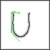
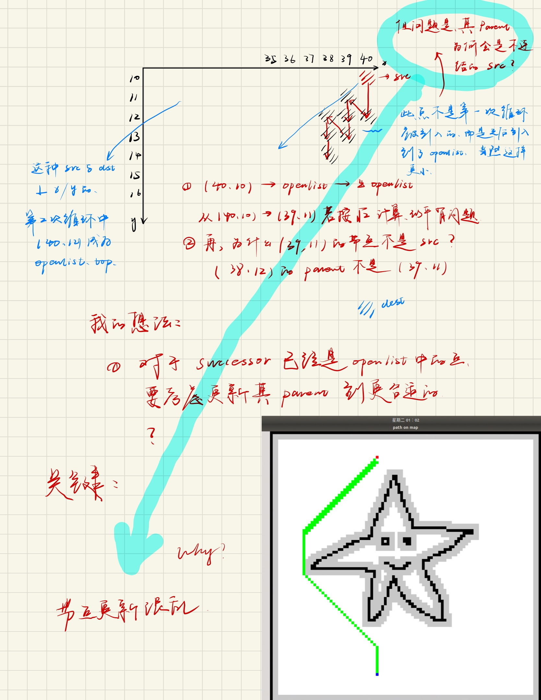

# A star search

## 1. frame of algorithm

link: https://www.geeksforgeeks.org/a-search-algorithm/

```
// A* Search Algorithm
1.  Initialize the open list
2.  Initialize the closed list
    put the starting node on the open 
    list (you can leave its f at zero)

3.  while the open list is not empty
    a) find the node with the least f on 
       the open list, call it "q"

    b) pop q off the open list
  
    c) generate q's 8 successors and set their 
       parents to q
   
    d) for each successor
        i) if successor is the goal, stop search
          successor.g = q.g + distance between 
                              successor and q
          successor.h = distance from goal to 
          successor (This can be done using many 
          ways, we will discuss three heuristics- 
          Manhattan, Diagonal and Euclidean 
          Heuristics)
          
          successor.f = successor.g + successor.h

        ii) if a node with the same position as 
            successor is in the OPEN list which has a 
           lower f than successor, skip this successor

        iii) if a node with the same position as 
            successor  is in the CLOSED list which has
            a lower f than successor, skip this successor
            otherwise, add  the node to the open list
     end (for loop)
  
    e) push q on the closed list
    end (while loop)
```

## 2. functions

* Open CV和Vector之间矩阵到二维数组的转换

* 判断有效
* 每次的下一个successor要判断是不是end
* 计算H
* tracePath，记录走过的节点，如果遇到block，路走不通，应该清空，并且放最小的开列表（top）进去
* AStar主函数
* 一个结构体

## 3. fake code and issues

每一个点应该有自己的数据结构，包含其parent node，f，g，h，这一点可以用结构体构造函数实现

三个主要的issue，trace path， a star， Visualization

### 3.1 trace path

### 3.2 A star

para：地图矩阵的Vector

return Void

**大致按照以下顺序进行**：

定义开列表和闭列表；

* 用STL，priority_queue来定义Open list，这样可以保证很方便地获取到f_least；
* 创建一个100*100的闭列表，初始时，定义所有元素均为false，都不在闭列表中；一旦有元素被加入，则设置闭列表该元素为true；
* 开列表用来筛选最小f，闭列表用来记录我们淘汰的路径，即使能走，我们可以选择经过，但所不会拿他再加入f=g+h的计算中了；

对起始点做初始化，该0的0，parent设默认（-1，-1）；

循环开始：

* 从开列表中拿出top元素，为f_least元素（因为openlist构造成了带优先级的队列，且pq默认是按照第一个参数排序，即为f；https://en.cppreference.com/w/cpp/container/priority_queue；
* 对该top元素操作，获得其f，和位置坐标；
* 该点从开列表弹出，进入闭列表（可以经过，但是不作为计算的考虑了）

接下来对3*3元素进行比较：

* 首先设置这9-1=8个元素的parent node为刚才pop的点
* 这8个点都可以作为下一个走的点，但是要进行判断
  * if blocked
  * if dest
  * if valid
  * if close list
* 剩下来的，比较所有里面最小的，作为下一个起点；其余的加到开列表，open list是一个待检查的列表；不是说开列表里面的每一个点都要经过，但是在我们每一次碰壁之后，开列表里面的点都是我们优先选择的对象；
* 是不是全放到开列表，下一次循环直接取top就可以了？不完全是，还必须是和这个点相连结的？是吗
* 该点进入闭列表，我们将不再考虑；
* 

### 3.3 Visual



* 可以看出，存在一些奇奇怪怪的路径，比如说重复走的路径也出现在了图上
* 这样保存的图只有在Open CV打开的时候十分清楚，保存下来之后画质很不行（我在考虑使用截图）
* 明白了，少了一个限制，关于是不是可以直接取open list的top元素；我认为不行：
  * 经过观察，发现算法这样写，从

