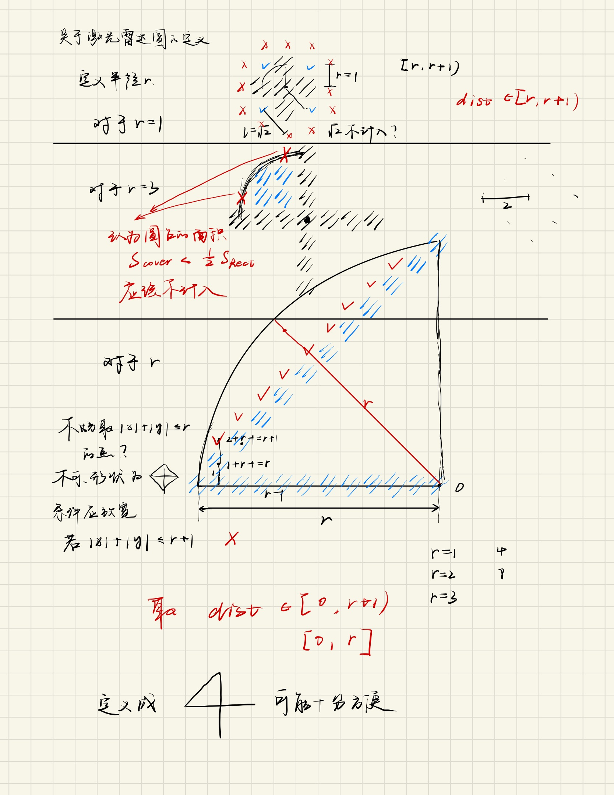
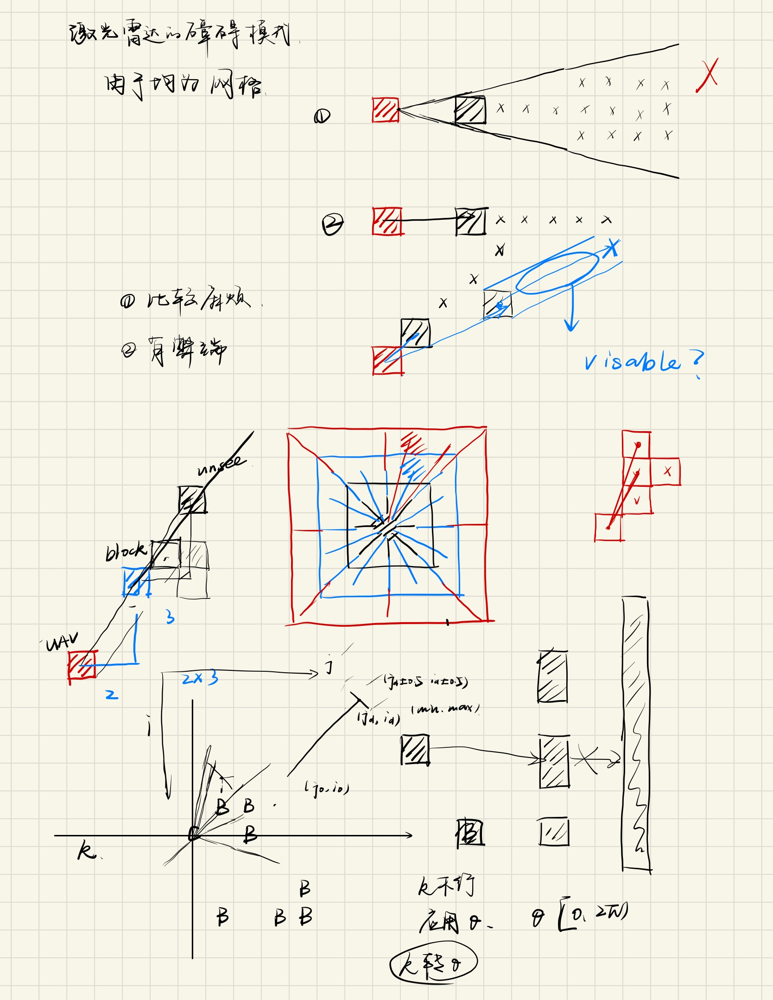
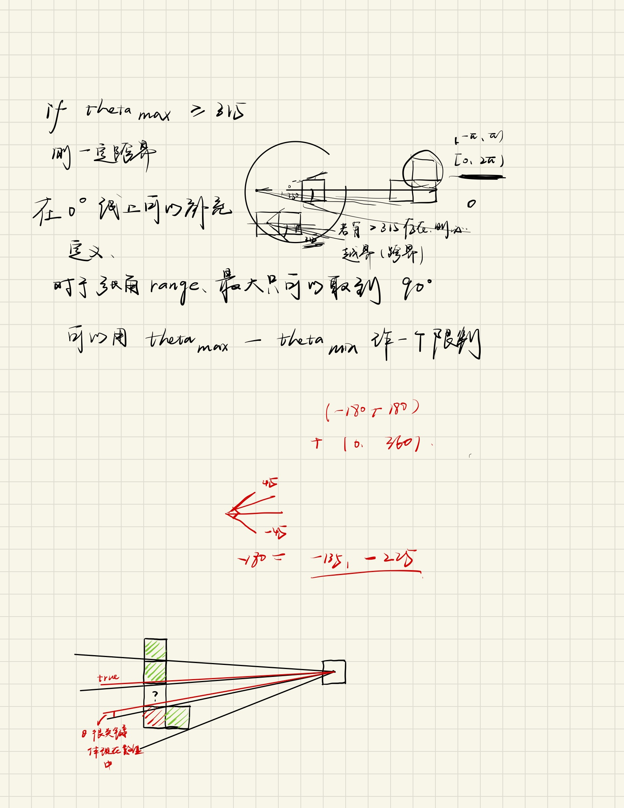
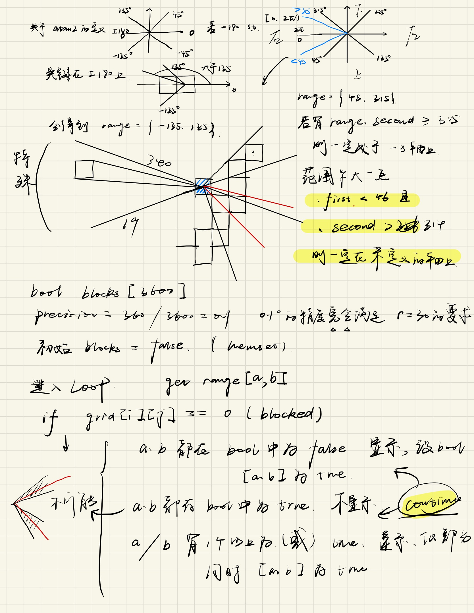

# Lidar stimulating

https://en.wikipedia.org/wiki/Lidar

先简单写以下一些思考

* 从函数上，关键在`isUnBlocked`这个函数的判断上，或许应该加一条`isChecked`
* 相比于全局地图，我们会发现虽然最终路径是最小的，但是中间夹杂着很多次无效的循环过程，这样的情况在引入激光雷达之后的动态规划上面将会大大减少；为什么，因为虽然是全局地图，但是f最小的方向不确定有没有block，设置的代码只有和障碍物相邻之后才会作出判断，好的，blocked，不考虑这个点，直接去找开列表的最小值；但是在激光雷达之后，（我认为）相当于每一个parent node的successor数量变多了，不只是8个，而是$r^2$个；
* 好像有点不对；
* 暂缓，涉及到动态规划了，下一部分内容；


关于雷达的仿真，关键是探测和动态显示两个问题

## Issue

在对每个点的分析过程中，首先会分析其是否有效，是否终点，是否闭列表，是否障碍物；

* 肯定不是所有点都能探测到，所以不应设这样的条件；
* 

### 1 探测

关键问题在，**能否穿透**；

初步设想是这样的：

* 首先，规定探测半径为$r$
* 然后选择从矩形到圆的近似
* r从1开始，递增，直到达到r
* 在这期间，每一次增量，根据矩形-圆近似的边缘数量，确定射线的个数









有一些算法叫做，遮挡剔除算法；通常见于游戏画面的渲染，unity3D这种东西上面，经过查阅，找到了几种算法（https://my.oschina.net/u/4589456/blog/4614918）；

对于HLR，Hidden Line Removal

* Raycasting，光线投射
* Painter's Algorithm，画家算法
* Warnock Algorithm，沃诺克算法
* BSP-Tree，二维空间分割树
* Z-Buffer，https://blog.csdn.net/Jurbo/article/details/75007260/

其中应用最流行的是Z-Buffer，试图从这里面找一些想法；


为了保证定义清楚，有理由据，采用方块角度式的测量方法

* 其实在线消隐问题中，通过穿入和穿出来判断，使用雷达其实只能得到障碍物表面的线段轮廓，但是由于在这里把障碍物设计成了像素级别的，这将十分难以处理和判别；
* 因此，我们应该将障碍物视为一个个像素不为1，而是远大于1的方块去考虑，暂时先忽略三维的高度，先从二维的正方形开始，去探测他的线，可以由两条线推出一个障碍物；
* 因此，需要采用角度遮蔽的方法，去判断在雷达的视角中，哪些被遮蔽了（不考虑雷达波在面上反射引起的影响，只认为雷达可以获得一个个点的距离和角度，进而拼合成线）

### 2 动态显示

```c++
waitKey(int delay);
```

可以很简单地起到一步一步来的效果；

接下来是，数据的实时回传，想到了callback function；

先实现一个简单的，移动center探测障碍物的函数；

函数要做到什么：

* 与键盘交互，上下左右建控制移动，按一次改变一次center的位置，然后传给画障碍物的函数（因为这是他的参数）
* 障碍物函数根据最新的center位置运行，之后等待新数据

**好像在Qt上面键盘的交互多一点？**

不如就先，写个循环，从哪到哪，然后延迟；

easy:

```c++
    for (int i = 62; i > 52; i--){
        showDetectBlocks(i, 53);
    }
```

