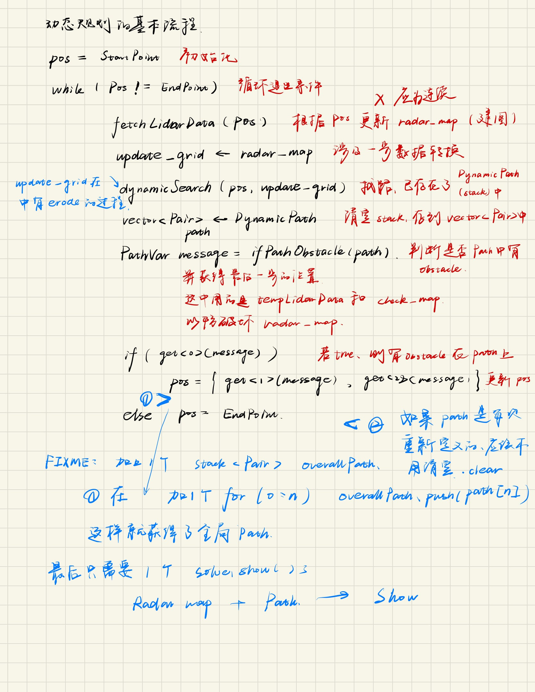
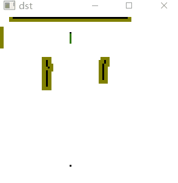
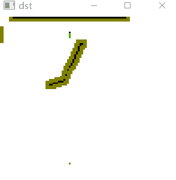

# 动态A star算法实现

由于雷达的仿真还有一些bug，在这个模块里先主要尝试动态的地图+A star算法

## 1 动态地图

即根据自身位置，设置无人机只知道自身某半径范围内的所有地图

## 2 动态规划

由于截至12-10日，雷达的仿真已经实现，现可以开始最后一步的设计，即动态规划；

需要详细考虑一下**数据流**

* 首先，无人机位于起始位置，该点已知；将该点的`pos`传入雷达地图获取函数；
* 生成一定半径以内探测到的障碍物`grid`，应该有两个grid，一个为0-1用于A*，一个保留0-2便于生成图片
* `grid`和`pos`用于A*算法，`grid`应是一个建图的过程；
* 在每一次建图完成后，跑一次A*，把Path入栈保存；在这次跑完的A star的Path中，断不会有与障碍物重叠的点；
* 对于`pos`路径的下一个节点，就是存在Path中的节点，从`pos`往下的一个，作为`pos`传给雷达扫描建图函数，更新0-1数组地图；
* 对于Path中当前点到终点，判断是否有的点在地图上为障碍物了，如果一旦出现，以当前位置为起始位置，再次开始A star，Path入stack

基本是这样；

## 3 结果

