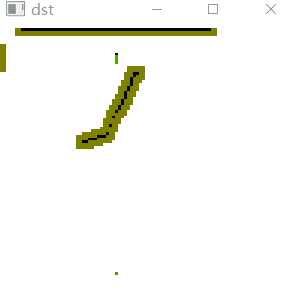

内容包含：

* 封皮：请使用[《报告封皮》](doc/课程报告-封皮.doc)，并填写各自的信息
* 研究目标：做这个课题的目的、目标
* 研究开发方案：如何思考的，使用什么技术去解决
* 关键技术：最主要的技术点
* 研究开发计划：研究开发的时间节点、里程碑
* 程序实现：自己的实现
* 结果：程序运行的效果
* 参考文献资料：参考的资料等

## 1. 研究目标

目标是实现无人机的感知与控制，在这里先不考虑其动态适应环境能力等；目标为设计一个工程仿真，使得无人机能够用机载传感器，如激光雷达等，探测障碍物并且自主规划路径，以最短路径到达目标点；在这之中需要额外考虑可视化的问题；

目的在于通过本课程设计将本科阶段所学的知识、技能串联起来，并通过本课程设计项目的牵引，学会如何做到目标分析、计划、工作分配、编程、实验、总结、汇报等多种能力，从而为后续的工作、研究生阶段的工作开展奠定能力基础；

## 2. 开发方案

初步将开发分为地图、算法、雷达、动态四个模块进行；

* 地图：包括地图的绘制、读取、解码和可视化四个部分；用基本的`fread()`操作和`OpenCV`中的`Mat`将相关类型转换，完成显示；
* 算法：使用`A star`启发式搜索算法，需要了解算法的理论并且在`C++`中实现；
* 雷达：考虑栅格地图的特点，完成雷达搜索的建模和算法的`C++`实现；
* 动态：考虑是否使用回调函数`CallBack function`的形式或是使用循环的方式完成；

## 3. 关键技术

### 3.1 地图

地图文件的格式是一个二进制文件，文件的结构如下：

* uint32_t (文件标识，内容是：0x15432345)
* int32_t （map的宽度-mx，像素数）
* int32_t （map的高度-my，像素数）
* int8_t * mx * my (map数组，mx * my个int32_t 类型数据，具体的每个点的类型)
* int32_t （起点的X坐标，startX）
* int32_t （起点的Y坐标，startY）
* int32_t （终点的X坐标，endX）
* int32_t （终点的Y坐标，endY）

相关的数据，通过`fread()`命令读入；各个变量是按照顺序排列的，要先在程序中声明定义各个变量，然后通过文件操作读入变量内容，准备下一步的解码和可视化操作；

`m_map`数组是一个一维数组，需要将其转化为二维数组，为了之后方便操作；在这里我们将障碍物定义为`0`，可通过的区域定义为`1`；

在显示时，需要使用`CV_8UC3`格式，因为之后涉及各种颜色的显示，迟早改为三通道；通过`at<Vec3b>`修改像素值，这样访问修改比较慢，可以找寻更好的方法；

由于在实际中，无人机不可能完全与障碍物擦肩而过，必须留有一定的安全裕度，也就是安全距离；在栅格地图中，这一点表现为像素的“扩散”，即原来一个$1\times1$的障碍物在实际的路径规划中会变成$5\times 5$的障碍物，这一点可以利用`OpenCV`中的形态学操作`erode()`来实现，参考[OpenCV: Eroding and Dilating](https://docs.opencv.org/4.x/db/df6/tutorial_erosion_dilatation.html)；

### 3.2 路径规划算法

A search比起广度优先和Dijkstra算法有明显的优势，因此在此我们参考国外一编程网站提供的算法介绍，参考[Geeks for Geeks: A search algorithm](https://www.geeksforgeeks.org/a-search-algorithm/)；如果对于A search算法先建立一个简单的印象，可以参考[A*寻路算法详解 b站 奇乐编程学院](https://www.bilibili.com/video/BV1bv411y79P?from=search&seid=11796441744772978102&spm_id_from=333.337.0.0)；

对于每个点坐标，使用`C++ STL`的`pair<typename, typename>`来存储数据；

同时，由于A search的特点，每一个开列表中的结点，需要存储其`g_cost`、`h_cost`、`f_cost`和`NodeParent`；这一点属于数据结构，这启发了我们使用结构体来实现自己的数据结构，通过`pair`构造自己的数据结构；

算法基本流程如下：

* 输入起始点坐标，起始点进入开列表；
* 当开列表不为空时，进入循环；取出开列表中`f_cost`的最小值，作为下一个节点计算；
* 对于从开列表取出的该节点，从开列表中删除，并且加入闭列表；
* 对与该节点周边的所有8个结点，分别判断其是否有效，是否是目的地，是否是闭列表中的点；
* 如果全部排除，则更新其每个节点的`g_cost`、`h_cost`、`f_cost`，并且设置当前节点为这些节点的父节点；
* 最后如果判断出相邻节点中有终点，则跳出循环，通过父节点的指示找到路径；

### 3.3 雷达仿真与实现

雷达是这其中比较麻烦的一个环节，其实现需要考虑到障碍物之间的遮蔽；

假设雷达发出无数条射线，这些射线每遇到一个障碍物，便会形成一个覆盖障碍物的区间；将这些区间合并起来，并且存储以方便查阅；当出现了一个新的障碍物，计算其角度区间：

* 如果该区间完全在已有的区间之内，则该障碍物被完全遮挡，雷达不会探测到
* 否则，该障碍物可以被探测到，并且将该障碍物的区间加入总区间；
* 半径由小到大，以菱形的方式扩散，这样能保证永远先算最近的障碍物，避免出现错误遮挡；


### 3.4 动态的路径规划

关键在于A search函数，需要给他添加两个参数，一个是起始点（因为在动态过程中，起始点一般在变化），另一个是表示地图的二维数组（因为雷达算作一个建图的过程，地图是不断更新的）；

思路：

* 无人机在起点开始用雷达建图，根据建图的结果规划一次路径；
* 无人机沿这条路径飞行，不断更新地图，直到无人机发现原来规划的路径上的点是障碍物；
* 无人机立刻在该点，重新开始路径规划；
* 循环，直到路径上没有障碍物，抵达目的地；

## 4. 开发计划

* 地图的读取，显示
* A star算法理论学习
* A star算法编写
* 雷达仿真建模
* 雷达算法编写
* 动态规划路径

## 5. 程序实现

### 5.1 地图

首先要在`CMakeList`中加入`OpenCV`

```cmake
#  OpenCV
FIND_PACKAGE(OpenCV REQUIRED)
INCLUDE_DIRECTORIES({OpenCV_INCLUDE_DIRS})

# link
TARGET_LINK_LIBRARIES(5_final ${OpenCV_LIBS})
```

然后进行`.map`文件的读取，存为`vector`数组：

```c++
Vec2int Solution::getVectorRawGrid(const string& mapName) {
    string FILEPATH = "../../maps/" + mapName;
    const char *filepath = (char*)FILEPATH.data();
    // read map
    int32_t m_mx, m_my, m_startX, m_startY, m_endX, m_endY;
    int8_t *m_map;
    Mat img;

    FILE        *fp;
    uint32_t    f_magic;

    // open file
    fp = fopen(filepath, "rb");
    if( fp == nullptr ) {
        printf("ERR: failed to open file %s!\n", filepath);
        exit(100);
    }

    // check file magic number
    fread(&f_magic, sizeof(uint32_t), 1, fp);
    if( f_magic != 0x15432345 ) {
        printf("ERR: input file format is not correct! %s\n", filepath);
        goto MAP_LOAD_RET;
    }

    // read map nx, ny
    fread(&m_mx, sizeof(int32_t), 1, fp);
    fread(&m_my, sizeof(int32_t), 1, fp);
    ROW = m_mx;
    COL = m_my;

    // read map
    m_map = new int8_t[m_mx * m_my];
    fread(m_map, sizeof(int8_t), m_mx * m_my, fp);

    // read start,end point
    fread(&m_startX, sizeof(int32_t), 1, fp);
    fread(&m_startY, sizeof(int32_t), 1, fp);
    fread(&m_endX, sizeof(int32_t), 1, fp);
    fread(&m_endY, sizeof(int32_t), 1, fp);
    StartPoint = {m_startX, m_startY};
    EndPoint = {m_endX, m_endY};

    MAP_LOAD_RET:
    fclose(fp);

    int cols = m_mx;
    // Mat to Vector2int
    for (int i = 0; i < m_mx; i++){
        for (int j = 0; j < m_my; j++){
            // 1 is reachable
            // 0 is blocked
            if (int(m_map[i * cols + j]) == 0){
                map_vector[i][j] = 1;
            }
            if (int(m_map[i * cols + j]) == 1){
                map_vector[i][j] = 0;
            }
        }
    }

    return map_vector;
}
```

如果要显示出灰度图，应将原来的0-1数组转为`Mat`的0-255：

```c++
img.at<uchar>(i, j) = int(m_map[i * cols + j]) * 255;
```

### 5.2 路径规划算法

简洁的算法思路如下：

```c++
void Solution::dynamicSearch(Pair &pos, Vec2int &m_grid) {
    // set begin time
    chrono::steady_clock::time_point t1 = chrono::steady_clock::now();

    Vec2int grid(ROW, vector<int>(COL));
    grid = getVectorBoundaryGrid(m_grid);

    // If the source is out of range
    if (!isValid(grid, StartPoint)) {
        printf("Source is invalid\n");
        return;
    }

    // If the destination is out of range
    if (!isValid(grid, EndPoint)) {
        printf("Destination is invalid\n");
        return;
    }

    // Either the source or the destination is blocked
    if (!isUnBlocked(grid, StartPoint)
        || !isUnBlocked(grid, EndPoint)) {
        printf("Source or the destination is blocked\n");
        return;
    }

    // If the destination cell is the same as source cell
    if (isDestination(StartPoint)) {
        printf("We are already at the destination\n");
        return;
    }

    // describe detail of each cell
    // using struct defined
    vector<vector <cell>> cellDetails(ROW, vector<cell>(COL));

    int i, j;
    // Initialising the parameters of the starting node
    i = pos.first, j = pos.second;
    cellDetails[i][j].cost_f = 0.0;
    cellDetails[i][j].cost_g = 0.0;
    cellDetails[i][j].cost_h = 0.0;
    cellDetails[i][j].nodeParent = {i, j};

    // Create a closed list and initialise it to false
    bool closedList[ROW][COL];
    memset(closedList, false, sizeof(closedList));

    priority_queue<Tuple, vector<Tuple>, greater<> > openList;
    // Type: Tuple
    // Container: vector
    // Functional: greater, least f will be on top of the queue

    openList.emplace(0.0, i, j);
    while(!openList.empty()){
        const Tuple& p = openList.top(); // first time, it will be start point
        // Add this vertex to the closed list
        i = get<1>(p); // second element of tuple
        j = get<2>(p); // third element of tuple

        // remove this vertex from open list and send it to close list
        openList.pop();
        closedList[i][j] = true;

        for (int add_x = -1; add_x <= 1; add_x++) {
            for (int add_y = -1; add_y <= 1; add_y++) {

                Pair neighbour(i + add_x, j + add_y);

                if (!isValid(grid, neighbour)){
                    return;
                }
                if (isDestination(neighbour)){
                    // set parent of destination cell
                    cellDetails[neighbour.first][neighbour.second].nodeParent = {i, j};
                    // print path
                    cout << "destination is found!" << endl;
                    dynamicTracePath(cellDetails, pos);
                    // set end time and show
                    chrono::steady_clock::time_point t2 = chrono::steady_clock::now();
                    chrono::duration<double> time_used = chrono::duration_cast<chrono::duration<double>>(t2 - t1);
                    cout << "solve time cost = " << time_used.count() << " seconds. " << endl;
                    // end
                    return;
                }
                else if (!closedList[neighbour.first][neighbour.second]
                         && isUnBlocked(grid, neighbour)){

                    // update weight values
                    double f_updated, g_updated, h_updated;
                    g_updated = cellDetails[i][j].cost_g + sqrt(pow(add_x, 2.0) + pow(add_y, 2.0));
                    h_updated = calculateHValue(neighbour, EndPoint);
                    f_updated = g_updated + h_updated;

                    // send less f_updated to open list
                    double temp_cost_f = cellDetails[neighbour.first][neighbour.second].cost_f;
                    if (f_updated < temp_cost_f || temp_cost_f == -1){
                        // -1 referring that this node doesn't belong to open list, shall be added in
                        // f_updated is less, shall be added in open list
                        // at first I was concerning about the StartPoint, then I just realized that
                        // StartPoint has been thrown into close list
                        openList.emplace(f_updated, neighbour.first, neighbour.second);

                        // update cost f, g, h and parent node of cellDetails
                        cellDetails[neighbour.first][neighbour.second].cost_f = f_updated;
                        cellDetails[neighbour.first][neighbour.second].cost_g = g_updated;
                        cellDetails[neighbour.first][neighbour.second].cost_h = h_updated;
                        // set parent of successors(not in Close list and is unblocked)
                        cellDetails[i + add_x][j + add_y].nodeParent = {i, j};
                    }

                }

            }

        }

    }


}
```

### 5.3 雷达仿真与实现

获取雷达建图数据的函数：

```c++
void Solution::fetchLidarData(Pair &pos, Vec2int &Vec) {
    // set radius
    int radius = 40;
    int pos_i = pos.first;
    int pos_j = pos.second;

    // open Lidar
    pair<double, double> range;
    vector<pair<double, double>> degreeInterval;
    degreeInterval.emplace_back(0.001, 0.002);
    int i, j;
    for (int r = 1; r <= radius; r++){
        for (i = pos_i - r; i <= pos_i + r; i++){
            for (j = pos_j - r; j <= pos_j +r; j++){
                if (!isValid(map_vector, {i, j})) continue;
                if (abs(i - pos_i) + abs(j - pos_j) != r || map_vector[i][j] == 1) continue;

                range = getThetaRange(pos, {i, j});
                if (range.second > 314 && range.first < 46 && map_vector[i][j] == 0){
                    degreeInterval = mergeInterval({0.0001, range.first}, degreeInterval);
                    degreeInterval = mergeInterval({range.second, 359.9999}, degreeInterval);
                    Vec[i][j] = 0;
                    continue;
                }
                if (checkInterval(range, degreeInterval)){
                    // if totally blocked by other obstacles, UAV was unaware of this obstacle
                    // have to consider another situation, that this [i][j] had been checked before
                    // and set as 0 which means unreachable, we can't make it invisible again in radar_map
                    // however, in image shown as to having used radar, it should be erased again
                    // that step is not necessary(for now)
                    // if (radar_map[i][j] == 0) radar_map[i][j] = 0;
                    // if (radar_map[i][j] == 1) radar_map[i][j] = 1;

                }else{
                    Vec[i][j] = 0;
                }
                degreeInterval = mergeInterval(range, degreeInterval);
            }
        }
    }

}
```

### 5.4 动态的路径规划

动态路径规划的主体函数如下：

```c++
	// clear all obstacles, forming a new map
    clearRadarMap();
    // initialize start point as StartPoint
    Pair pos = StartPoint;
    fetchLidarData(pos, radar_vector);

    int number = 0;
    cout << "into loop launch.." << endl;

    while(pos != EndPoint){
        // clear check_vector
        for (int i = 0; i < ROW; i++){
            for (int j = 0; j < COL; j++){
                check_vector[i][j] = 1;
            }
        }

        cout << "loop:" << number << endl;
        number = number + 1;

        printf("(%d, %d) pos\n", pos.first, pos.second);

        // store path in stack DynamicStack
        dynamicSearch(pos, radar_vector);

        // test if obstacle on path
        vector<Pair> path;
        while(!DynamicPath.empty()){
            Pair p = DynamicPath.top();
            DynamicPath.pop();
            path.emplace_back(p);
        }
        cout << "path data read in..." << endl;
        for (auto & i : path){
            cout << "data in path:" << i.first << ", " << i.second << endl;
        }

        PathVar message = ifPathObstacle(path);

        cout << get<0>(message) << endl;
        if (get<0>(message)){
            // update pos to last one
            pos = {get<1>(message), get<2>(message)};
            int num = get<3>(message);
            for (int i = 0; i <= num; i++){
                fetchLidarData(path[i], radar_vector);
                OverallPath.emplace_back(path[i]);

                cout << path[i].first << ", " << path[i].second << endl;
            }
        }if (!get<0>(message)){
            for (auto & i : path){
                OverallPath.push_back(i);
            }
            pos = EndPoint;
            cout << "end founded..." << endl;
        }
    }

}
```

### 5.5 函数头文件

函数头文件里注明了函数的功能、参数、输出等；

```cpp
    /**
     * set start point in coordinate position, then trans to array pos
     * @param x corPos x
     * @param y corPos y
     */
    void setStartPoint(int x, int y);

    /**
     * set end point in coordinate position, then trans to array pos
     * @param x corPos x
     * @param y corPos y
     */
    void setEndPoint(int x, int y);

    /**
     * transfer coordinate position to (i, j) display in array which starting at [0]
     * @param corPos pair(STL, C++) coordinate position of a point
     * @return array position
     */
    static Pair cor2ArrayPos(Pair corPos);

    /**
     * check whether given cell (row, col) is a valid cell or not.
     * @param grid
     * @param point
     * @return bool
     */
    bool isValid(const vector<vector <int>> &grid, const Pair& point) const;

    /**
     * A Utility Function to check whether the given cell is blocked or not
     * @param grid
     * @param point
     * @return
     */
    bool isUnBlocked(const vector<vector <int>> &grid, const Pair& point) const;

    /**
     * A Utility Function to check whether destination cell has been reached or not
     * @param position
     * @param dest
     * @return
     */
    bool isDestination(const Pair& position);

    /**
     * A Utility Function to calculate the 'h' heuristics
     * @param src
     * @param dest
     * @return
     */
    static double calculateHValue(const Pair& src, const Pair& dest);

    /**
     * transfer vector<vector<int>> to gray scale Mat(image)
     * @param grid
     * @return Mat mat
     */
    Mat vector2ObstacleMap(Vec2int &grid) const;

    /**
     * read m_map array from file(mapName), write it in map_vector
     * @param mapName
     * @return map_vector
     */
    Vec2int getVectorRawGrid(const string& mapName);

    /**
     * using erode function in openCV to add boundaries
     * @param grid
     * @return vector<vector<int>>
     */
    Vec2int getVectorBoundaryGrid(Vec2int &grid) const;

    /**
     * transfer cv::Mat to vector<vector<int>>
     * @param src
     * @param m
     * @param n
     * @return
     */
    static vector<vector<int>> mat2Vector(Mat &src, int m, int n);

    /**
     * transfer vector<vector<int>> to cv::Mat
     * @param vec
     * @return
     */
    static Mat vector2Mat(vector<vector<int>> &vec);

    /**
     * Lidar Stimulation, fetch data from radar based on position currently
     * @param pos
     * @param Vec
     */
    void fetchLidarData(Pair &pos, Vec2int &Vec);

    /**
     * merge Intervals
     * @param newRange
     * @param intervals
     * @return
     */
    static vector<pair<double, double>> mergeInterval(const pair<double, double> &newRange,
                                               vector<pair<double, double>> &intervals);

    /**
     * check if the interval you input is included in intervals that you check
     * @param newRange
     * @param intervals
     * @return
     */
    static bool checkInterval(const pair<double, double> &newRange,
                                 vector<pair<double, double>> &intervals);

    /**
     * calculate degree range of a RECT
     * assuming radar located at point_0, target pos is point_d
     * @param point_0
     * @param point_d
     * @return
     */
    static pair<double, double> getThetaRange(Pair point_0, Pair point_d);

    /**
     * clear vector maps already scanned
     * cos 1 means visible and reachable, setting it as 1
     */
    void clearRadarMap();

    /**
     * launch radar
     */
    void launchRadar();

    /**
     * A star search while pos and grid is changing
     * @param pos
     * @param m_grid
     */
    void dynamicSearch(Pair &pos, Vec2int &m_grid);

    /**
     * trace path when A star is finished
     * @param cellDetails
     * @param pos
     */
    void dynamicTracePath(const vector<vector <cell>> &cellDetails, const Pair &pos);

    /**
     * check if there is Obstacle on Path calculated by A star
     * @param path
     * @return
     */
    PathVar ifPathObstacle(vector<Pair> &path);

    /**
     * show path using openCV
     */
    void showPath();
```


## 6. 结果





## 7. 参考文献

* [Geeks for Geeks: A search algorithm](https://www.geeksforgeeks.org/a-search-algorithm/)
* [A*寻路算法详解 b站 奇乐编程学院](https://www.bilibili.com/video/BV1bv411y79P?from=search&seid=11796441744772978102&spm_id_from=333.337.0.0)
* [OpenCV: Eroding and Dilating](https://docs.opencv.org/4.x/db/df6/tutorial_erosion_dilatation.html)

