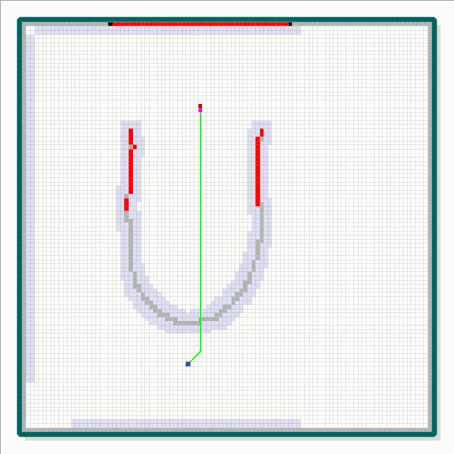
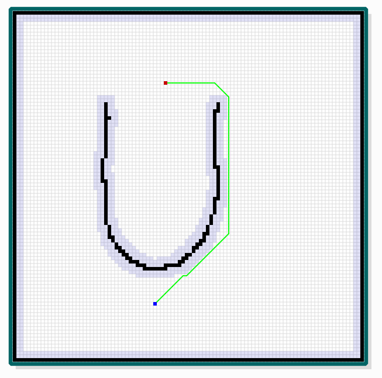
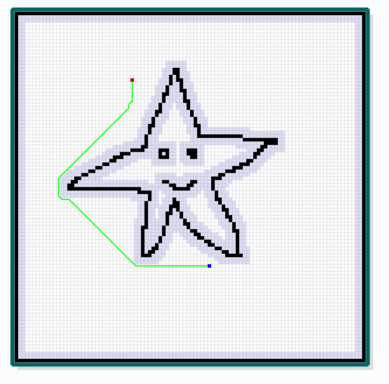

# 无人机路径规划

目前无人机虽然实现了自动飞行，但是大部分的无人机仍不具备感知环境、动态适应环境的能力。本课题通过一步一步实现无人机的感知、路径规划、仿真，通过本项目理解无人机系统的感知与控制。

本课题需要实现的效果如下图所示



## 1. 课题的假设和实现过程

* 无人机从`红色的起点`出发，朝向`蓝色的终点`飞行，但是事先不知道环境地图（障碍物）的分布。
* 假设无人机上装备了激光雷达，能够探测一定范围内的障碍物信息，如上图所示

    * 当前探测到的障碍物用红色显示

    * 还未探测到的障碍物用灰色显示

    * 已经探测到的障碍物用黑色显示
* 无人机利用A * 算法规划当前认为可行的路径，绿色的线段
* 但是随着探测范围扩大，无人机在飞行过程发现，利用之前规划的路线无法达到目标点，则需要重新规划路径
* 利用上述方法，不断探测障碍物，并不断规划路径，无人机最终到达目标点


## 2. 课题研究、开发内容和要求

本课程设计可分成如下的几个步骤，大家可以按照下面的引导一步一步从简单的功能开始做起，逐步增加功能，最终实现全部功能。

### 2.1 Step1 实现最基本的地图加载、显示

学习[《C++编程》](https://gitee.com/pi-lab/learn_programming)，[《Qt编程》](https://gitee.com/pi-lab/code_cook/tree/master/gui/qt)，或者使用Matlab等编程语言，根据自己的能力和背景知识。

加载地图文件，显示在GUI界面上。可以使用[【Qt示例程序 - 画网格】](https://gitee.com/pi-lab/code_cook/tree/master/gui/qt/1_draw_grid)，在这个示例程序的基础上增加功能，从而实现第一步的目标。

示例地图文件见[《示例地图》](maps)





地图文件的格式是一个二进制文件，文件的结构如下：
* uint32_t (文件标识，内容是：0x15432345)
* int32_t （map的宽度-mx，像素数）
* int32_t （map的高度-my，像素数）
* int8_t * mx * my (map数组，mx * my个int32_t 类型数据，具体的每个点的类型)
* int32_t （起点的X坐标，startX）
* int32_t （起点的Y坐标，startY）
* int32_t （终点的X坐标，endX）
* int32_t （终点的Y坐标，endY）

地图每个像素的值的定义：
```C++
enum RMapItemType
{
    RMAP_FREE = 0,					// 空白区域
    RMAP_OBSTACLE,					// 障碍物
    RMAP_OBSTACLE_UNDESCOVERED,		// 未被发现的障碍物
    RMAP_OBSTACLE_SCANNED,			// 已被扫描到的障碍物
    RMAP_START_POINT,				// 起点
    RMAP_END_POINT,					// 终点
    RMAP_CURRENT_POSITION,			// 当前点
    RMAP_OBSTACLE_EDGE				// 障碍物扩展的点
};
```

地图读取示例程序如下：
```C++
int RMap::load(const char *fname)
{
    FILE        *fp = NULL;
    int         res, ret = -1;
    uint32_t    f_magic;

    // open file
    fp = fopen(fname, "rb");
    if( fp == NULL ) {
        printf("ERR: failed to open file %s!\n", fname);
        return -1;
    }

    // check file magic number
    res = fread(&f_magic, sizeof(uint32_t), 1, fp);
    if( f_magic != 0x15432345 ) {
        printf("ERR: input file format is not correct! %s\n", fname);
        goto RMAP_LOAD_RET;
    }

    // read map nx, ny
    res = fread(&m_mx, sizeof(int32_t), 1, fp);
    res = fread(&m_my, sizeof(int32_t), 1, fp);

    // read map
    if( m_map != NULL ) delete [] m_map;
    m_map = new int8_t[m_mx*m_my];
    res = fread(m_map, sizeof(int8_t), m_mx*m_my, fp);

    // read start,end point
    res = fread(&m_startX, sizeof(int32_t), 1, fp);
    res = fread(&m_startY, sizeof(int32_t), 1, fp);
    res = fread(&m_endX, sizeof(int32_t), 1, fp);
    res = fread(&m_endY, sizeof(int32_t), 1, fp);

    ret = 0;

RMAP_LOAD_RET:
    fclose(fp);

    return ret;
}
```


### 2.2 - Step2 实现路径规划与显示
在前面程序的基础上，实现A * 算法，在这个阶段可以假设环境地图都已知，规划全局的地图，并显示在GUI界面上。

### 2.3 - Step3 实现激光雷达的扫描
在Step1的程序基础上，模拟激光雷达扫描。模拟从当前位置发射多条射线，判断障碍物是否在射线上。把结果显示在在GUI界面上。

### 2.4 - Step4 动态路径规划
在Step2, Step3的成果基础上，设计动态路径的算法，并实现该算法。测试所实现的方法和示例效果的差别，并改进


## 3. 深入思考

* 如何实现无人机的定位？

* 如何使用三维激光雷达生成三维地图？

* 如何使用相机生成三维地图？

* 如何考虑飞行器的飞行特性，实现平滑的轨迹？

* 如果是多个无人机，如何共享地图，加快搜索和任务执行效率？

    

## 4. 参考资料

### 4.1 A*算法

* [路径规划之 A* 算法](https://zhuanlan.zhihu.com/p/54510444)
* [A*算法详解(个人认为最详细,最通俗易懂的一个版本)](https://blog.csdn.net/Zhouzi_heng/article/details/115035298)
* [A*算法（超级详细讲解，附有举例的详细手写步骤）](https://blog.csdn.net/dujuancao11/article/details/109749219)


### 4.2 Qt教程与示例程序
* [Qt安装说明](https://gitee.com/pi-lab/learn_programming/tree/master/6_tools/qt)
* [Qt教程与示例程序](https://gitee.com/pi-lab/code_cook/tree/master/gui/qt)
* [Qt示例程序 - 画网格](https://gitee.com/pi-lab/code_cook/tree/master/gui/qt/1_draw_grid)
* [Qt示例程序 - 画能够缩放的地图](https://gitee.com/pi-lab/code_cook/tree/master/gui/qt/2_draw_map)

### 4.3 编程与工具

* [C++编程](https://gitee.com/pi-lab/learn_programming)

